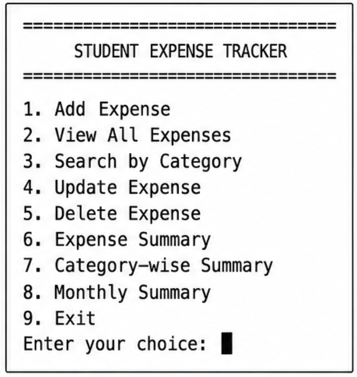
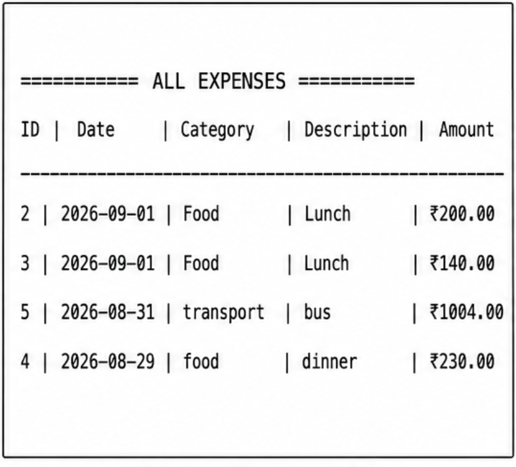
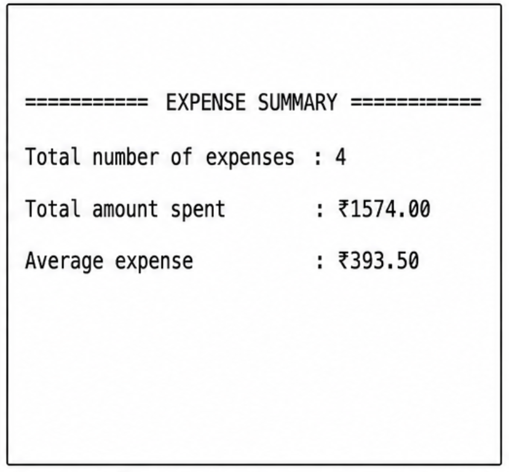
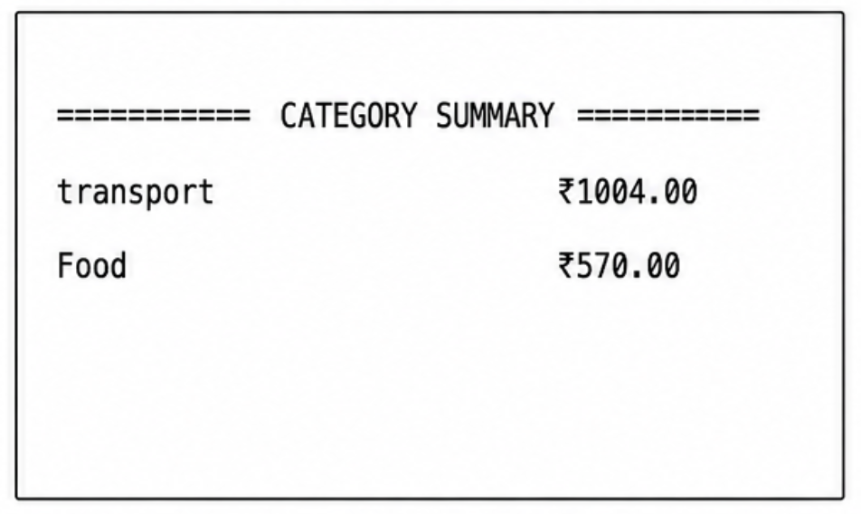
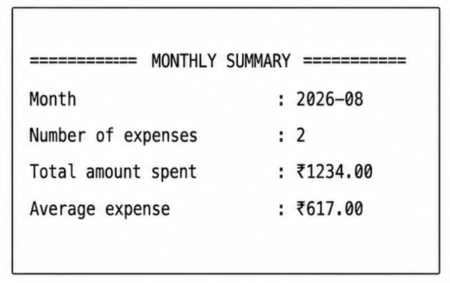

<h1 align="center">💰 Student Expense Tracker</h1>

<p align="center">
A Python + MySQL based expense management application
</p>

<p align="center">
Record • Manage • Search • Analyze Expenses
</p>

<p align="center">


</p>

A command-line based Student Expense Tracker built using **Python and MySQL**.

This project allows students to record and manage their daily expenses. It provides features for adding, viewing, searching, updating, and deleting expenses, along with useful expense summaries.

---

## Features

- Add a new expense
- View all expenses
- Search expenses by category
- Update an existing expense
- Delete an expense
- View total expense summary
- View category-wise expense summary
- View monthly expense summary
- Store expense records permanently using MySQL
- Simple and user-friendly command-line interface

---

## Technologies Used

- **Python 3**
- **MySQL**
- **MySQL Connector/Python**
- **SQL**
- **VS Code**

---

## Project Structure

```text
StudentExpenseTracker/
│
├── main.py
├── database.py
├── README.md
└── __pycache__/
```

### main.py

Contains the main application logic and menu system.

It handles:

- Adding expenses
- Viewing expenses
- Searching expenses
- Updating expenses
- Deleting expenses
- Expense summaries
- Category-wise summaries
- Monthly summaries

### database.py

Contains the MySQL database connection code used by the application.

---

## Database

The project uses **MySQL** to store expense records.

### Database Name

```text
student_expense_tracker
```

### Table Name

```text
expenses
```

### Expenses Table Fields

| Field | Description |
|---|---|
| `id` | Unique ID of the expense |
| `expense_date` | Date of the expense |
| `category` | Category of the expense |
| `description` | Description of the expense |
| `amount` | Amount spent |

---

# How to Run

## 1. Install MySQL Connector

Open the terminal in VS Code and run:

```bash
pip3 install mysql-connector-python
```

---

## 2. Open MySQL

Open the MySQL command-line client.

On macOS, you can use:

```bash
/usr/local/mysql/bin/mysql -u root -p
```

Enter your MySQL password when prompted.

---

## 3. Create the Database

After entering MySQL, create the database:

```sql
CREATE DATABASE student_expense_tracker;
```

Select the database:

```sql
USE student_expense_tracker;
```

---

## 4. Create the Expenses Table

Run the following SQL command:

```sql
CREATE TABLE expenses (
    id INT AUTO_INCREMENT PRIMARY KEY,
    expense_date DATE NOT NULL,
    category VARCHAR(50) NOT NULL,
    description VARCHAR(255),
    amount DECIMAL(10,2) NOT NULL
);
```

---

## 5. Configure the Database Connection

Open the `database.py` file.

The connection should contain your MySQL username, password, and database name.

Example:

```python
import mysql.connector

def create_connection():
    connection = mysql.connector.connect(
        host="localhost",
        user="root",
        password="YOUR_MYSQL_PASSWORD",
        database="student_expense_tracker"
    )

    return connection
```

Replace `YOUR_MYSQL_PASSWORD` with your own MySQL password.

**Never upload your real MySQL password to GitHub.**

---

## 6. Run the Application

Open the terminal inside the project folder and run:

```bash
python3 main.py
```

The application will display the following menu:

```text
==============================
      STUDENT EXPENSE TRACKER
==============================

1. Add Expense
2. View All Expenses
3. Search by Category
4. Update Expense
5. Delete Expense
6. Expense Summary
7. Category-wise Summary
8. Monthly Summary
9. Exit
```

---

# How to Use

## 1. Add Expense

Select option:

```text
1
```

Enter the required information:

- Date
- Category
- Description
- Amount

Example:

```text
Enter date (YYYY-MM-DD): 2026-09-01
Enter category: Food
Enter description: Lunch
Enter amount: 120
```

The expense will be stored in the MySQL database.

---

## 2. View All Expenses

Select option:

```text
2
```

The application displays all saved expenses.

Example:

```text
========== ALL EXPENSES ==========

ID | Date       | Category    | Description       | Amount
-------------------------------------------------------------
1  | 2026-09-01 | Food        | Lunch             | ₹120.00
```

---

## 3. Search by Category

Select option:

```text
3
```

Enter a category such as:

```text
Food
```

The application displays all expenses belonging to that category.

---

## 4. Update Expense

Select option:

```text
4
```

Enter the ID of the expense you want to update.

You can update:

- Date
- Category
- Description
- Amount

The updated information is saved in the MySQL database.

---

## 5. Delete Expense

Select option:

```text
5
```

Enter the ID of the expense you want to delete.

The selected expense will be removed from the database.

---

## 6. Expense Summary

Select option:

```text
6
```

The application displays:

- Total number of expenses
- Total amount spent
- Average expense

Example:

```text
========== EXPENSE SUMMARY ==========

Total number of expenses : 5
Total amount spent       : ₹1250.00
Average expense          : ₹250.00
```

---

## 7. Category-wise Summary

Select option:

```text
7
```

The application calculates the total amount spent in each category.

Example:

```text
========== CATEGORY SUMMARY ==========

Food             ₹570.00
Transport       ₹1004.00
```

---

## 8. Monthly Summary

Select option:

```text
8
```

The application displays the total expenses for each month.

This helps the user understand monthly spending patterns.

---

## 9. Exit

Select option:

```text
9
```

The application asks for confirmation before exiting.

Example:

```text
Are you sure you want to exit? (y/n):
```

---

# CRUD Operations

This project implements the four basic database operations:

| Operation | Feature |
|---|---|
| **Create** | Add Expense |
| **Read** | View and Search Expenses |
| **Update** | Update Expense |
| **Delete** | Delete Expense |

---

# Application Workflow

```text
             Student Expense Tracker
                       │
                       ▼
                Main Menu
                       │
        ┌──────────────┼──────────────┐
        ▼              ▼              ▼
   Add Expense    View Expenses   Search Expense
        │              │              │
        └──────────────┼──────────────┘
                       ▼
                 MySQL Database
                       │
        ┌──────────────┼──────────────┐
        ▼              ▼              ▼
      Update         Delete        Summary
                                     │
                          ┌──────────┼──────────┐
                          ▼          ▼          ▼
                       Overall   Category    Monthly
```

---

# Learning Outcomes

Through this project, I learned and practiced:

- Python programming
- Functions
- Conditional statements
- Loops
- User input handling
- SQL queries
- MySQL database management
- Python-MySQL connectivity
- CRUD operations
- Data retrieval
- Data updating and deletion
- SQL aggregation functions
- Grouping data using SQL
- Building a command-line application

---

# Future Improvements

The project can be further improved by adding:

- Graphical User Interface (GUI)
- User login and authentication
- Student profile management
- Expense charts and graphs
- Budget tracking
- Monthly budget limits
- Budget alerts
- Export expenses to CSV or Excel
- Web-based version
- Mobile application

---

# Author

**Aryan Mor**

B.Tech Computer Science & Engineering  
Specialization: Machine Learning

---

# Project Purpose

This project was developed as a practical learning project to understand how **Python applications interact with relational databases using MySQL**.

It demonstrates the implementation of database operations through a simple and practical student expense management system.

---

# License

This project is created for educational and learning purposes.

## 📸 Application Screenshots

### 1. Main Menu



### 2. View All Expenses



### 3. Expense Summary



### 4. Category-wise Summary



### 5. Monthly Summary

